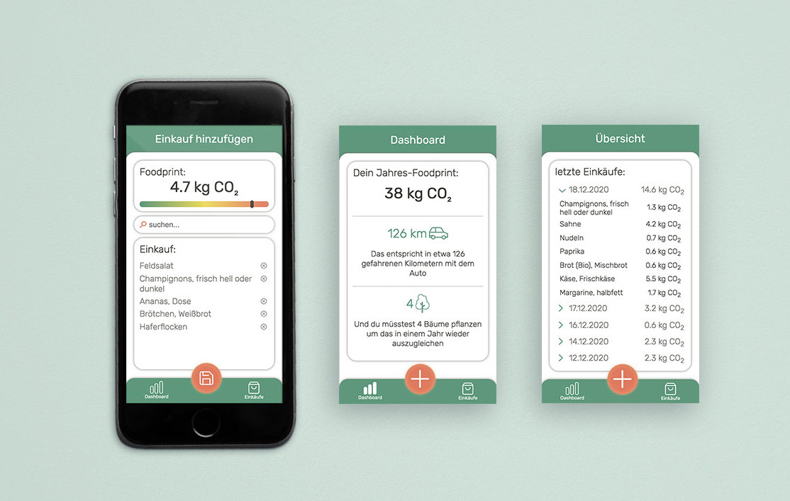

# Foodprint

> Capstone project for web-development bootcamp at neue fische

## Description
> How much CO2 do you eat per day?

Foodprint is a Web-App that calculates your carbon footprint in regards of the food you consume day by day. It allows you to learn more about which foods cause much CO2 and which ones have a smaller impact. You can easily search for food and add it to your list in order to have an overview of your total Foodprint per year.

### Demo

You can find the demo version of the app [here](https://capstone-project.mariereese.vercel.app/)

## Tech Stack

- React
- React Hooks
- React Router
- styled-components
- prop-types
- Styleguidist
- Jest
- React Testing Library

## How set up this project

- clone this repository
- install all npm dependencies:

  `npm install`

- to run the app in development mode `npm start`, then open http://localhost:3000 to view it in the browser
- to run Styleguidist
  `npm run styleguide`
- to run React Testing Library & Jest
  `npm test`
